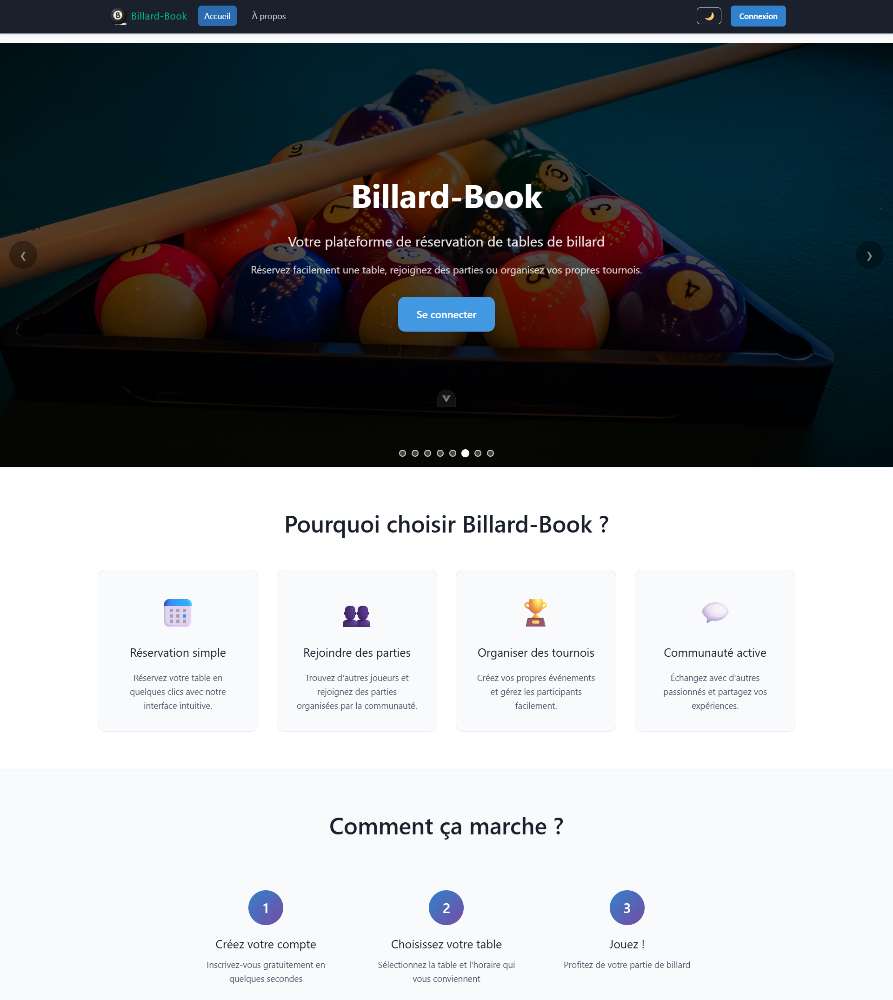

# Billard-Book

<!-- Badges -->
[](https://app.netlify.com/projects/billard-book/deploys)
[](https://github.com/Amine830/spring-billard-reservation/actions/workflows/ci-multistage.yml)


Educational platform for billiard table booking management, composed of a Java API (Spring-like structure) and a Vue 3 SPA frontend.

## Learning Goals

This project is designed to demonstrate:

- A REST API with lightweight hypermedia (links followed by the client)
- Spring Boot with a modular architecture and good engineering practices (design patterns, separation of concerns, DTO, DAO, filters)
- Stateless JWT authentication
- A modern frontend stack (Vue 3 + Pinia + SPA routing)
- Client-side state management (stores, targeted refresh, backend health UX)
- Resilience concepts (health checks, retry backoff)
- Delivery readiness (multi-stage Docker, build/push scripts, environment variables)
- Future extension paths (persistence, CI/CD, observability)

Demo data note: data is periodically reset to keep the environment lightweight. Do not store sensitive information.

## Repository Content

| Path | Role | Detailed docs |
|------|------|---------------|
| `server/` | REST API (reservations, users, JWT) | [`server/README.md`](server/README.md) |
| `client/` | Web app (Vue 3, Pinia, theming, SPA) | [`client/README.md`](client/README.md) |
| `nginx.conf` | Example static reverse proxy config | - |
| `docs/docker/` | Consolidated Docker documentation | [`docs/docker/README.md`](docs/docker/README.md) |
| `scripts/docker/` | Scripts (build-push, stop) | - |
| `docker-compose.yml` | Optional orchestration (API + placeholders for client and DB) | See Docker section |

## Quick Start

Prerequisite: Docker. Docker Compose is optional and kept for legacy workflows.

```bash
# Build image (context = server/)
docker build -t billard-book-api:dev server/

# Run locally (port 8080)
docker run --rm -p 8080:8080 billard-book-api:dev

# In another terminal:
curl -f http://localhost:8080/actuator/health
```

Push to Docker Hub (example):

```bash
./scripts/docker/build-push.sh monuser 0.1.0
# push (:0.1.0 & :latest)
docker pull monuser/billard-book-api:0.1.0     # verification
docker run --rm -p 8080:8080 monuser/billard-book-api:0.1.0
```

For more details, see "Deploying to Docker Hub" in [docs/docker/README.md](docs/docker/README.md).

Legacy commands `deploy.sh`, `dev.sh`, `status.sh`, `start-daemon.sh`, and `setup.sh` were removed to simplify maintenance.

Client (development mode):

```bash
cd client
npm install
npm run dev
# Open http://localhost:5173 (default Vite port)
```

## Global Architecture

```text
┌──────────────┐        ┌──────────────┐
│   Client SPA │ <----> │    API REST  │
│  (Vue + TS)  │  JWT   │  (Java)      │
└──────────────┘        └──────────────┘
        ▲                       │
        │ Axios + Pinia         │ In-memory (DB-ready)
        ▼                       ▼
   Light/dark theme         Services / DAOs / JWT
```

Highlights:

- JWT authentication (token stored in client localStorage)
- Reservation workflows with register/unregister, comments, and full-capacity status
- Responsive client with light/dark theme toggle
- Link-following (simplified HATEOAS) on the client to enrich reservation data

## Security Overview

- JWT token is attached to outgoing requests (axios interceptor)
- Claims are refreshed after key operations (create, register, etc.)
- No server session (stateless) with configurable expiration (`JWT_EXPIRATION_MS`)

## API Environment Variables (examples)

Define according to your platform:

- `SPRING_PROFILES_ACTIVE=docker`
- `JAVA_OPTS=-Xmx512m -Xms256m`
- `JWT_EXPIRATION_MS=3600000`
- `PORT` (provided by some PaaS platforms, fallback 8080)

## Main Scripts

Backend: build with Maven (see [API README](server/README.md)).
Frontend: `npm run dev | build | preview | lint` (see [client README](client/README.md)).

## Tests

- Server-side unit tests (see `server/`)
- Frontend tests to add (Vitest + Testing Library)

## Docker Overview

Single API image built with multi-stage Docker: [`server/Dockerfile`](server/Dockerfile).

- Default exposed port: `8080` (override with `-e PORT=...`)
- Internal health endpoint: `/actuator/health`
- Build/test/push automation script: `scripts/docker/build-push.sh`
- Full guide: `docs/docker/README.md`
- `docker-compose.yml` is optional and not required for simple local tests

Quick test example:

```bash
docker build -t test-api server/ && docker run --rm -p 8080:8080 test-api
```

## Additional Resources

- OpenAPI: [`server/openapi/Billard-Book-api.yaml`](server/openapi/Billard-Book-api.yaml)
- Postman collection: [`server/postman/`](server/postman/)
- Favicon and PWA manifest: [`client/public/`](client/public/site.webmanifest)
- Screenshots: [`docs/screenshots/`](docs/screenshots/)

## Roadmap

- [ ] Add frontend tests
- [ ] Add WebSocket/SSE for real-time comments
- [ ] Add reservation pagination and filtering
- [ ] Add internationalization (FR/EN)
- [ ] Add database persistence (PostgreSQL) + migrations
- [ ] Improve authentication and role management


## Visual Preview



More screenshots and labels: [`docs/screenshots/`](docs/screenshots/).

## Contribution

1. Fork and create a feature branch
2. Ensure local lint/build is green
3. Open a PR with a clear description (include screenshots for UI changes)
4. Follow TypeScript style and Java conventions

---

For deeper technical details, read the dedicated documentation in [`server/`](server/) and [`client/`](client/).

## Contact

- Maintainer: [@Amine830](https://github.com/Amine830)
- Bugs and ideas: open a GitHub issue (labels `bug`, `enhancement`)
- Frontend demo: Netlify (see status badge above)
- API image: Docker Hub (see Docker section)

For advanced requests (persistence, CI/CD, observability), open a dedicated issue.

## License

This project is licensed under MIT (see [`LICENSE`](LICENSE)).