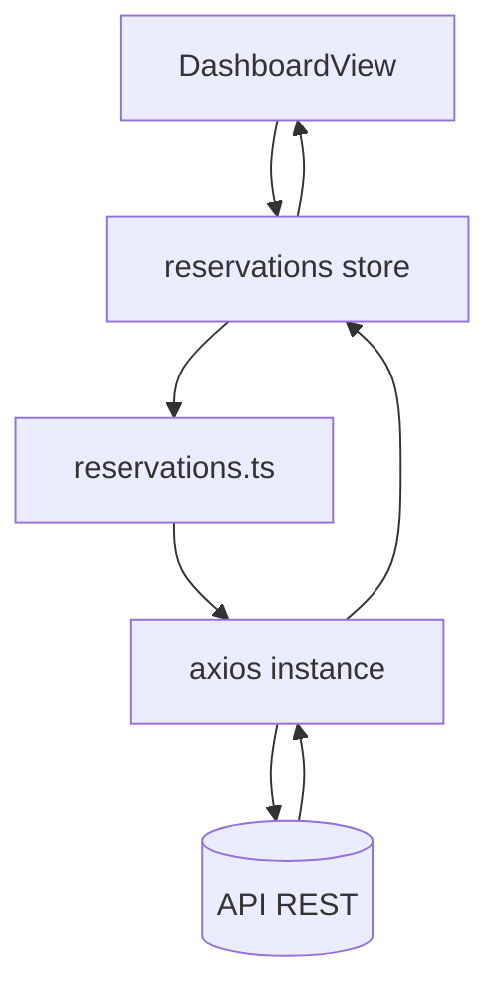

# Client Web Billard-Book

## 🎯 Vue d'ensemble

Application SPA (Single Page Application) permettant de consommer l'API Billard‑Book : authentification, gestion des réservations (création, inscription / désinscription), commentaires, vue détaillée, liste utilisateurs, thème sombre/clair et navigation unifiée.

## 🧱 Pile technologique

| Domaine | Choix | Raison |
|---------|-------|--------|
| Framework UI | Vue 3 + Composition API | Simplicité + réactivité fine |
| Langage | TypeScript | Sécurité de types & DX |
| Bundler | Vite | Démarrage ultra rapide + HMR |
| State Management | Pinia | Store modulaire léger & TS friendly |
| HTTP Client | Axios | Intercepteurs faciles pour JWT |
| Routing | Vue Router 4 | Navigation SPA + guards |
| Styling | CSS natif modulé + variables thème | Contrôle fin + faible coût |
| Auth persist | localStorage (token) | Simplicité côté client |

## 🗂️ Structure du projet (client/)

```bash
client/
  index.html              # Entrée HTML (balises favicon + manifest)
  public/                 # Actifs statiques servis tels quels
  src/
    main.ts               # Bootstrapping Vue + Pinia + Router
    App.vue               # Shell global + barre de navigation + ThemeToggle
    assets/
      base.css            # Reset / fondations
      main.css            # Variables de thème + styles globaux
    components/
      ThemeToggle.vue     # Bascule dark/light persistée
      CreateReservationModal.vue # Formulaire modale création réservation
    router/
      index.ts            # Définition des routes & guards d'auth
    services/             # Accès API (axios abstrait)
      api.ts              # Instance axios + intercepteurs token
      auth.ts             # Auth endpoints
      users.ts            # Récupération utilisateurs
      reservations.ts     # CRUD + commentaires + inscription
    stores/
      auth.ts             # Store utilisateur / token / actions login/register
      reservations.ts     # Store réservations (listes, détail, mutations)
    types/
      index.ts            # Interfaces partagées UI
    views/                # Pages de haut niveau (routées)
      HomeView.vue
      LoginView.vue
      DashboardView.vue
      ReservationDetailView.vue
      UsersView.vue
      AboutView.vue
```

## 🔐 Authentification côté client

Liste des points clés :

- Le token JWT retourné par l'API est intercepté et stocké (Authorization → localStorage).
- Chaque requête sortante (sauf endpoints publics) ajoute `Authorization: Bearer <token>`.
- Au démarrage (`App.vue`) si un token existe, on tente de rafraîchir l'utilisateur courant.
- Le mot de passe côté UI est "normalisé" (l'implémentation backend utilisant un champ spécifique a été masquée dans la vue Login/Inscription).
- Page Profil (`/profile`) : modification du mot de passe (PUT `/users/{login}`) + suppression compte (DELETE) avec confirmation.

## 🌐 Routing & Navigation

| Route | Nom | Auth requise | Description |
|-------|-----|--------------|-------------|
| `/` | home | Non | Page d'accueil marketing + CTA |
| `/login` | login | Non (redirige si déjà loggé) | Connexion / inscription |
| `/users` | users | Oui (peut être public selon config) | Listing des utilisateurs |
| `/about` | about | Non | Présentation rapide |
| `/profile` | profile | Oui | Gestion du compte (stats + changement mot de passe + suppression) |
| `/dashboard` | dashboard | Oui | Liste des réservations (actives + terminées), actions & commentaires |
| `/reservations/:id` | reservation-detail | Oui | Détail d'une réservation (players, comments) |
| `/reservations/:id/edit` | reservation-edit | Oui (owner) | Édition / suppression réservation |

Guards :

- `meta.requiresAuth` → redirection vers `/login` si non authentifié.
- Visite `/login` déjà loggé → redirection `/dashboard`.

## 🗃️ State Management (Pinia)

### Store `auth`

- State : `user`, `token`, `loading`, `error`.
- Actions : `login`, `register`, `logout`, `fetchCurrentUser`.
- Getters : `isAuthenticated` (boolean).

### Store `reservations`

- State : `reservations` (brutes), `currentReservation`, `loading`, `error`.
- Mutations / Actions principales :
  - `fetchReservations()` : charge collection (follow links → détails).
  - `fetchReservation(id)` : charge détail unique.
  - `createReservation(data)`.
  - `registerToReservation(id)` / `unregisterFromReservation(id)` (rafraîchissent uniquement la liste des joueurs via endpoint `/players`).
  - `refreshPlayers(id)` : action interne pour ne mettre à jour que `players`.
  - `addComment(id, {content})` (recharge le détail complet – optimisation future possible).
- Dérivés : filtrage `activeReservations` vs `completedReservations`.
- Interne : normalisation des players (extraction login depuis liens).

## 🔄 Flux de données (ex. réservation)



## 💬 Commentaires

- Stockés dans la réservation (liste ordonnée).
- Ajout via POST `/reservations/{id}/comment` (réponse 204) puis rafraîchissement ciblé.
- UI : zone repliable sur dashboard + bloc dédié dans la vue détail.

## 👥 Inscriptions / Désinscriptions

- POST `/reservations/{id}/register` (body `{}` obligatoire pour Content-Type JSON).
- DELETE `/reservations/{id}/unregister`.
- Après action : seul le tableau `players` est rafraîchi (GET `/reservations/{id}/players`) au lieu de recharger l'objet complet.
- Règles UI : bouton désactivé si passé, complet, déjà inscrit (pour inscription) ou si terminé (pour désinscription).

## 🛠️ Édition / Suppression de réservation

Vue `ReservationEditView.vue` (route `/reservations/:id/edit`) :

- Accès réservé au propriétaire (contrôle login == ownerId après fetch).
- Champs éditables : table, date/heure début, durée (recalcule endTime localement).
- Boutons : sauvegarder, réinitialiser, supprimer (dialogue confirmation).

## 👤 Gestion du profil

Vue `ProfileView.vue` :

- Affiche login + compteurs (créées / participations).
- Modification mot de passe (PUT) sans afficher l'ancien.
- Suppression compte (DELETE) → logout + redirection login.

## ❤️ Health-check & Résilience

- Store `system` + service `systemService.getHealth()`.
- Poll adaptatif: base 30s, backoff exponentiel (×1.6 jusqu'à 5 min) si DOWN (cold start Render support).
- Bannière rouge en haut si indisponible.

## 🌍 Configuration multi-environnements

- Variable `VITE_API_BASE_URL` (ex: `https://<your-api-url>`).
- En développement (non définie) : proxy Vite `/api` → backend local (voir `vite.config.ts`).

Build production exemple :

```bash
VITE_API_BASE_URL=https://<your-api-url> npm run build
```

Le bundle utilisera alors l'URL distante directement.

## 🎨 Thème sombre / clair

- Variables CSS (`--color-bg`, `--color-surface`, `--color-text`, etc.) définies dans `main.css`.
- Attribut `data-theme="dark|light"` appliqué sur `<body>`.
- Persistance clé `theme` (localStorage) + détection `prefers-color-scheme`.
- Composant `ThemeToggle.vue` (icône 🌙 / ☀️ + bascule).

### Principales variables

```css
:root { --color-bg:#f8fafc; --color-surface:#fff; --color-text:#1a202c; }
body[data-theme="dark"] { --color-bg:#0f172a; --color-surface:#1e293b; --color-text:#e2e8f0; }
```

## 🧩 Composants clés

| Composant | Rôle |
|-----------|------|
| `App.vue` | Shell + nav + injection ThemeToggle |
| `LoginView.vue` | Login/Inscription (UI normalisée) |
| `UsersView.vue` | Liste utilisateurs + stats basiques |
| `ThemeToggle.vue` | Gestion & persistance du thème |
| `DashboardView.vue` | Agrégation réservations + actions + commentaires inline |
| `ReservationDetailView.vue` | Vue complète réservation |
| `CreateReservationModal.vue` | Formulaire création (validation basique) |

## 🛡️ Sécurité & Confort

- Intercepteur axios : ajout automatique du token sauf endpoints publics.
- Redirection guard (perte de session → page login).
- Désactivation des actions invalides (passé, complet, déjà inscrit).
- Sanitisation simple côté client (trim des commentaires).

## ⚠️ Gestion des erreurs UI

| Contexte | Stratégie |
|----------|-----------|
| Auth | Message dans `authStore.error` affiché sous formulaire |
| Réservations | Message dans sections + bouton Réessayer |
| Création réservation | Message dans la modale (bloc rouge) |

## 📦 Build & Scripts

Depuis le dossier `client/` :

| Script | Commande | Description |
|--------|----------|-------------|
| Dev | `npm run dev` | Démarrage Vite + HMR |
| Build | `npm run build` | Build production (dist) |
| Preview | `npm run preview` | Prévisualisation du build |
| Lint | `npm run lint` | Vérification ESLint |

*(Vérifier le `package.json` pour les scripts exacts si modifiés)*

## 🚀 Performance & Optimisations

- Chargement paresseux des vues (import() dans le router) sauf Home.
- Suivi des liens de réservations en parallèle (promises) → agrégation UI.
- Minimisation CSS personnalisée (pas de framework lourd).
- Cache navigateur naturel pour assets `public/`.

## 🧪 Tests

(Aucun test frontend formalisé présent actuellement. Ajout recommandé : vitest + Testing Library pour stores & composants critiques.)

## 🛠️ Points d'extension futurs

1. Pagination / filtrage des réservations.
2. WebSocket ou SSE pour commentaires temps réel sans refresh manuel.
3. Profil utilisateur dédié (`/users/:login`).
4. Formulaire édition réservation (owner uniquement).
5. Accessibilité (ARIA rôles + focus management modale).
6. Animations douces sur bascule thème (transition `color, background-color`).

## 🔧 Snippet intercepteur axios (résumé)

```ts
api.interceptors.response.use(resp => {
  const auth = resp.headers['authorization']
  if (auth?.startsWith('Bearer ')) saveToken(auth.slice(7))
  return resp
})
```

---
*Documentation client générée pour refléter l'état actuel de l'interface et faciliter l'onboarding & l'évolution.*
