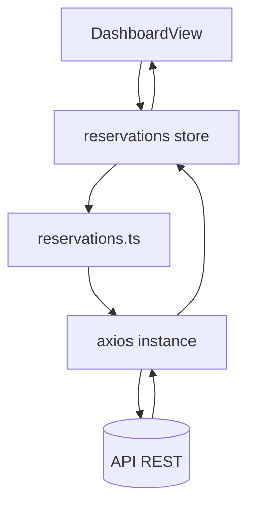

# Billard-Book Web Client

## Overview

This SPA (Single Page Application) consumes the Billard-Book API and provides authentication, reservation management (create, register/unregister), comments, detailed views, user listing, light/dark theme support, and unified navigation.

## Technology Stack

| Domain | Choice | Why |
|--------|--------|-----|
| UI Framework | Vue 3 + Composition API | Simplicity and fine-grained reactivity |
| Language | TypeScript | Type safety and developer experience |
| Bundler | Vite | Fast startup and HMR |
| State Management | Pinia | Lightweight modular stores with great TS support |
| HTTP Client | Axios | Easy JWT interceptor integration |
| Routing | Vue Router 4 | SPA navigation and route guards |
| Styling | Native CSS + theme variables | Fine control and low overhead |
| Auth Persistence | localStorage (token) | Client-side simplicity |

## Project Structure (client/)

```bash
client/
  index.html              # HTML entry point (favicon + manifest tags)
  public/                 # Static assets served as-is
  src/
    main.ts               # Vue + Pinia + Router bootstrap
    App.vue               # Global shell + navigation + ThemeToggle
    assets/
      base.css            # Reset/foundation styles
      main.css            # Theme variables + global styles
    components/
      ThemeToggle.vue     # Persisted dark/light switch
      CreateReservationModal.vue # Reservation creation modal
    router/
      index.ts            # Route definitions and auth guards
    services/             # API access layer (axios abstraction)
      api.ts              # Axios instance + token interceptors
      auth.ts             # Auth endpoints
      users.ts            # Users endpoints
      reservations.ts     # Reservation CRUD + comments + registration
    stores/
      auth.ts             # User/token state + login/register actions
      reservations.ts     # Reservation state (lists, detail, mutations)
    types/
      index.ts            # Shared UI interfaces
    views/                # Top-level routed pages
      HomeView.vue
      LoginView.vue
      DashboardView.vue
      ReservationDetailView.vue
      UsersView.vue
      AboutView.vue
```

## Client Authentication

Key points:

- The JWT returned by the API is intercepted and stored (Authorization header to localStorage)
- Every outgoing request (except public endpoints) includes `Authorization: Bearer <token>`
- On startup (`App.vue`), if a token exists, the app attempts to refresh the current user
- UI password handling is normalized (legacy backend-specific field behavior is hidden from the login/register view)
- Profile page (`/profile`) supports password update (PUT `/users/{login}`) and account deletion (DELETE) with confirmation

## Routing and Navigation

| Route | Name | Auth Required | Description |
|-------|------|---------------|-------------|
| `/` | home | No | Landing page and CTA |
| `/login` | login | No (redirects if already logged in) | Sign in / sign up |
| `/users` | users | Yes (can be restricted by config) | User listing |
| `/about` | about | No | Project overview |
| `/profile` | profile | Yes | Account management (stats + password change + deletion) |
| `/dashboard` | dashboard | Yes | Reservation lists (active + completed), actions, and comments |
| `/reservations/:id` | reservation-detail | Yes | Reservation details (players, comments) |
| `/reservations/:id/edit` | reservation-edit | Yes (owner) | Reservation edit/delete |

Guards:

- `meta.requiresAuth` redirects to `/login` when unauthenticated
- Visiting `/login` while authenticated redirects to `/dashboard`

## State Management (Pinia)

### `auth` store

- State: `user`, `token`, `loading`, `error`
- Actions: `login`, `register`, `logout`, `fetchCurrentUser`
- Getter: `isAuthenticated` (boolean)

### `reservations` store

- State: raw `reservations`, `currentReservation`, `loading`, `error`
- Main actions:
  - `fetchReservations()`: loads collection (follow links to details)
  - `fetchReservation(id)`: loads one reservation detail
  - `createReservation(data)`
  - `registerToReservation(id)` / `unregisterFromReservation(id)` (refresh players only through `/players` endpoint)
  - `refreshPlayers(id)`: internal targeted players update
  - `addComment(id, { content })` (currently reloads full detail)
- Derived lists: `activeReservations` vs `completedReservations`
- Internal normalization: extracts player login values from links

## Data Flow (reservation example)



## Comments

- Stored inside reservation objects (ordered list)
- Added through POST `/reservations/{id}/comment` (204 response), then targeted refresh
- UI is available both in the dashboard collapsible area and the dedicated detail view

## Registration / Unregistration

- POST `/reservations/{id}/register` (empty JSON body `{}` required)
- DELETE `/reservations/{id}/unregister`
- After action, only `players` is refreshed (GET `/reservations/{id}/players`) instead of reloading full reservation data
- UI rules disable actions when reservation is in the past, full, or already joined

## Reservation Edit/Delete

`ReservationEditView.vue` (`/reservations/:id/edit`):

- Owner-only access (login must match `ownerId`)
- Editable fields: table, start date/time, duration (end time is recomputed locally)
- Actions: save, reset, delete (with confirmation dialog)

## Profile Management

`ProfileView.vue`:

- Displays login plus counters (created reservations / participations)
- Supports password update (PUT) without exposing previous password
- Supports account deletion (DELETE), then logout and login redirect

## Health Check and Resilience

- `system` store + `systemService.getHealth()`
- Adaptive polling: 30s base interval, exponential backoff (`x1.6` up to 5 minutes) when backend is DOWN
- Top warning banner shown when backend is unavailable

## Multi-Environment Configuration

- `VITE_API_BASE_URL` (example: `https://<your-api-url>`)
- In development (undefined variable), Vite proxy maps `/api` to local backend (see `vite.config.ts`)

Build production exemple :

```bash
VITE_API_BASE_URL=https://<your-api-url> npm run build
```

The bundle will then call the remote API URL directly.

## Light/Dark Theme

- CSS variables (`--color-bg`, `--color-surface`, `--color-text`, etc.) are defined in `main.css`
- `data-theme="dark|light"` is applied on `<body>`
- Theme preference is persisted in localStorage (`theme`) with `prefers-color-scheme` detection
- `ThemeToggle.vue` handles UI switching

### Main Variables

```css
:root { --color-bg:#f8fafc; --color-surface:#fff; --color-text:#1a202c; }
body[data-theme="dark"] { --color-bg:#0f172a; --color-surface:#1e293b; --color-text:#e2e8f0; }
```

## Key Components

| Component | Role |
|-----------|------|
| `App.vue` | App shell, navigation, theme toggle integration |
| `LoginView.vue` | Login/register UI |
| `UsersView.vue` | User listing and basic stats |
| `ThemeToggle.vue` | Theme switch and persistence |
| `DashboardView.vue` | Reservation aggregation, actions, inline comments |
| `ReservationDetailView.vue` | Full reservation detail view |
| `CreateReservationModal.vue` | Reservation creation form |

## Security and UX Safeguards

- Axios interceptor injects token automatically except on public endpoints
- Route guards handle session loss and redirect to login
- Invalid actions are disabled in UI (past reservation, full reservation, already joined)
- Basic client-side sanitization (comment trimming)

## UI Error Handling

| Context | Strategy |
|---------|----------|
| Auth | Message displayed through `authStore.error` under the form |
| Reservations | Inline message in section + retry button |
| Reservation creation | Error message inside modal |

## Build and Scripts

Run from the `client/` folder:

| Script | Command | Description |
|--------|---------|-------------|
| Dev | `npm run dev` | Start Vite with HMR |
| Build | `npm run build` | Build production bundle (`dist`) |
| Preview | `npm run preview` | Preview production build |
| Lint | `npm run lint` | Run ESLint checks |

Check `package.json` if script definitions change.

## Performance and Optimization

- Lazy-loaded route components (`import()`), except Home
- Parallel reservation link following for faster UI aggregation
- Lightweight custom CSS (no heavy framework dependency)
- Standard browser caching for `public/` assets

## Tests

No formal frontend test suite is currently included. Recommended additions: Vitest + Testing Library for critical stores and components.

## Future Extensions

1. Reservation pagination and filtering
2. WebSocket or SSE for real-time comments without manual refresh
3. Dedicated user profile route (`/users/:login`)
4. Enhanced reservation edit workflow (owner-only)
5. Accessibility improvements (ARIA roles and modal focus management)
6. Smooth theme transition effects (`color`, `background-color`)

## Axios Interceptor Snippet (summary)

```ts
api.interceptors.response.use(resp => {
  const auth = resp.headers['authorization']
  if (auth?.startsWith('Bearer ')) saveToken(auth.slice(7))
  return resp
})
```

---
This client documentation reflects the current application behavior and is intended to simplify onboarding and future iteration.
